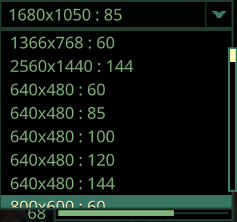

# Quasimorph Move Resolutions to Top

Primarily a tool for modders.

In the graphics options resolution dropdown, moves the specified resolution to the top of the list and the highest resolution as the second.

Speeds up changing between a small window for debugging and a large window for playing.

Defaults to 1366 x 768 x 60, but can be configured

# Configuration

The configuration file will be created on the first game run and can be found at `%AppData%\..\LocalLow\Magnum Scriptum Ltd\Quasimorph\QM_GraphicsResolutionToTop\QM_GraphicsResolutionToTop.json`.

|Name|Default|Description|
|--|--|--|
|Resolution|1366 x 768 x 60|The resolution to move to the top of the list|

# Support
If you enjoy my mods and want to leave a tip, check out my [Ko-Fi](https://ko-fi.com/nbkredspy71915) page.
Thanks!

# Source Code
Source code is available on GitHub at https://github.com/NBKRedSpy/QM_GraphicsResolutionToTop
